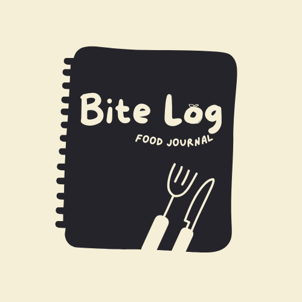

    
    <h1>Food Journal</h1>

## Requirements

This application fulfils the following [The C# Academy - Food Journal](https://thecsharpacademy.com/project/41/food-journal) project requirements:

- [x] This is an application to track meals.
- [x] Your data schema should have at least a "Meals" and a "Foods" table, in a many-to-many relationship.
- [x] You should have a MealType enumeration (Breakfast, Lunch, Dinner, Snack), which will be recorded in the meals table.
- [x] Your app should have a vibrant color palette.
- [x] There should be a feature that allows the users to quickly record frequent meals.
- [x] There should be a search functionality (per date, per food, per meal type).
- [x] There should be a report feature with queries such as how many times the user had a certain food per period of time.

## Challenges

This project has the following challenges:
- [x] Add macronutrients categorization.
- [ ] Add a "cheat meal" feature to record how many times the user ate junk food or candies.
- [ ] Add goals such as: drinking 20 liters of water in a week, or avoiding chocolate for 7 days.
- [ ] To enrich your app, try to fetch food data from a free Api.
