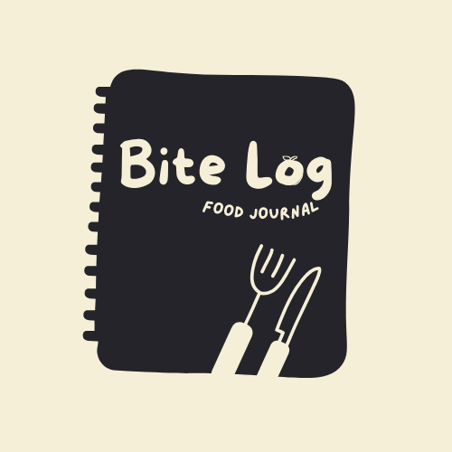

    
    <h1>Food Journal</h1>

## Requirements

This application fulfills the following [The C# Academy - Food Journal](https://thecsharpacademy.com/project/41/food-journal) project requirements:

- [ ] This is an application to track meals.
- [ ] Your data schema should have at least a "Meals" and a "Foods" table, in a many-to-many relationship.
- [ ] You should have a MealType enumeration (Breakfast, Lunch, Dinner, Snack), which will be recorded in the meals table.
- [ ] Your app should have a vibrant color palette.
- [ ] There should be a feature that allows the users to quickly record frequent meals.
- [ ] There should be a search functionality (per date, per food, per meal type).
- [ ] There should be a report feature with queries such as how many times the user had a certain food per period of time.
